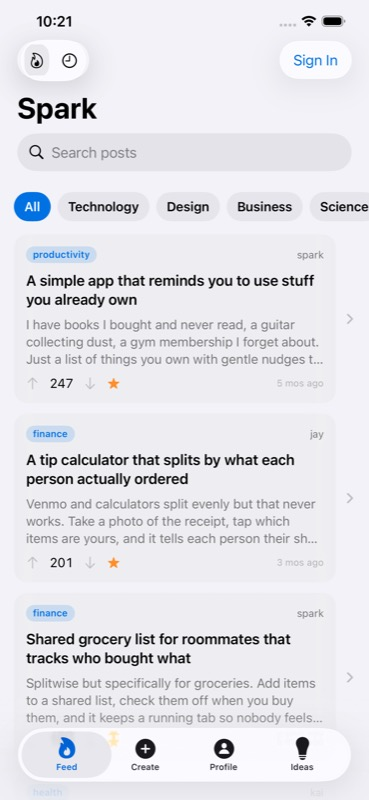

# Spark

  [](https://github.com/nulljosh/spark)

Idea-sharing platform with upvoting, comments, JWT auth, and AI enrichment. Native companions for iOS, macOS, and watchOS.

[Live](https://spark.heyitsmejosh.com)

## Platforms

| Platform | Version | Status |
|---|---|---|
| Web (PWA) | v2.1.0 | Live |
| iOS | v2.1.0 | App Store submission in progress |
| macOS | v1.0.0 | App Store submission in progress |
| watchOS | v1.0.0 | Bundled with iOS |



## Features

- Vanilla JS -- single `index.html`, no build step
- JWT auth with sign up, login, biometric (Face ID / Touch ID on iOS)
- Category filters and Hot/New sorting
- Upvoting and trending with optimistic UI
- LLM enrichment (SPEC + PLAN) via Claude daemon
- Idea Bases: AI-generated idea clusters from a topic
- Comment threads on posts, markdown export
- Dark/light theme toggle
- PWA with offline support
- Vercel serverless + Supabase PostgreSQL (RLS enabled)
- Responsive grid layout (2-col desktop, 1-col mobile)
- Post tags (tech, design, business, random) with filter bar
- Curated seed ideas for new users

## Run

```bash
npx serve .
npm test
```

Deploy (manual, monorepo): `npx vercel --prod` from this directory.

## Database Setup (one-time)

Run this in the [Supabase SQL editor](https://supabase.com/dashboard/project/tjsxsqlxjmanwvmywwvw/sql/new) to enable pixel avatar support:

```sql
alter table users add column if not exists avatar_url text;
```

## Known Issues


## Security Roadmap

- [ ] Purge old `.env` from git history (was committed in 3 old commits, no longer tracked): `brew install git-filter-repo && git filter-repo --path spark/.env --invert-paths` then force-push

## App Store Submission

ASC app record created (id: 6785162492). IPA built and exported. Upload blocked by Xcode 26 beta SDK — App Store rejects beta builds. Once Xcode 26 stable ships, run:

```bash
asc builds upload --app 6785162492 --ipa /tmp/SparkExport/Spark.ipa --wait
```

Screenshots ready in `screenshots/ios/` (feed, sign-in, profile, ideas). Metadata in `ios/fastlane/metadata/en-US/`.

## Roadmap

**App Store — icons (2026-06-28)**
- [x] App icon alpha channel stripped (was why ASC showed blank icon — Apple drops icons with alpha); macOS icon set created + wired in project.yml. Use `~/.agents/skills/icon/`.
- [ ] **Ship fresh iOS + macOS builds** — icons are fixed on disk but ASC only updates the icon from a newly *processed* build. `xcodegen generate` in ios/ and macos/, then archive + upload (`ship` / asc-xcode-build), wait ~5–30 min.
- [ ] Pick a mononame (rename "Spark Ideas") — cascades into bundle IDs + ASC records, do as its own task

**App Store**
- [ ] Submit iOS to App Store — blocked on Xcode 26 stable (beta SDK rejected by ASC); IPA + ASC record ready
- [ ] Submit macOS to Mac App Store — widget embed error fixed 2026-07-01 (SparkWidgets appex was missing CFBundleIdentifier; GENERATE_INFOPLIST_FILE now on), build succeeds locally. Remaining: create ASC app record for com.heyitsmejosh.spark.mac (no Mac app entry exists — use asc-app-create-ui), then archive + upload
- [ ] Add marketing landing page at `/landing` (currently feed is the homepage)
- [ ] 1 more iOS screenshot (post detail with AI enrichment) for 5-screenshot requirement

**Auth & Accounts**
- [ ] SMTP email delivery for password reset
- [ ] watchOS login UI (currently view-only without iOS pre-auth)

**Features**
- [ ] AI idea building — daemon auto-generates implementation plan/scaffold on post create
- [ ] Real-time updates via Supabase Realtime
- [ ] Infinite scroll / pagination (feed currently loads all posts)
- [ ] Moderation tools

**Done**
- [x] iOS + macOS + watchOS companion apps
- [x] AI enrichment (SPEC + PLAN via Claude daemon)
- [x] Idea Bases (AI topic clustering)
- [x] Comment threads
- [x] Seed 20+ quality ideas across all categories
- [x] ASC app record, PrivacyInfo.xcprivacy, fastlane metadata, screenshots

## Changelog

- v2.0.0: JWT_SECRET rotated, Supabase RLS hardened
- v1.3.0: Better seed ideas, RLS enabled on all Supabase tables, comment threads, iOS v2.0 (comments, profiles, sort, badges, 60+ tests), macOS + watchOS companions, WidgetKit widgets
- v1.2.0

## License

MIT 2026 Joshua Trommel

## From Spark.pdf (imported 2026-06-28)
- [x] Renamed ASC app from "Spark - spark" → "Spark: Ideas" (2026-06-28)
