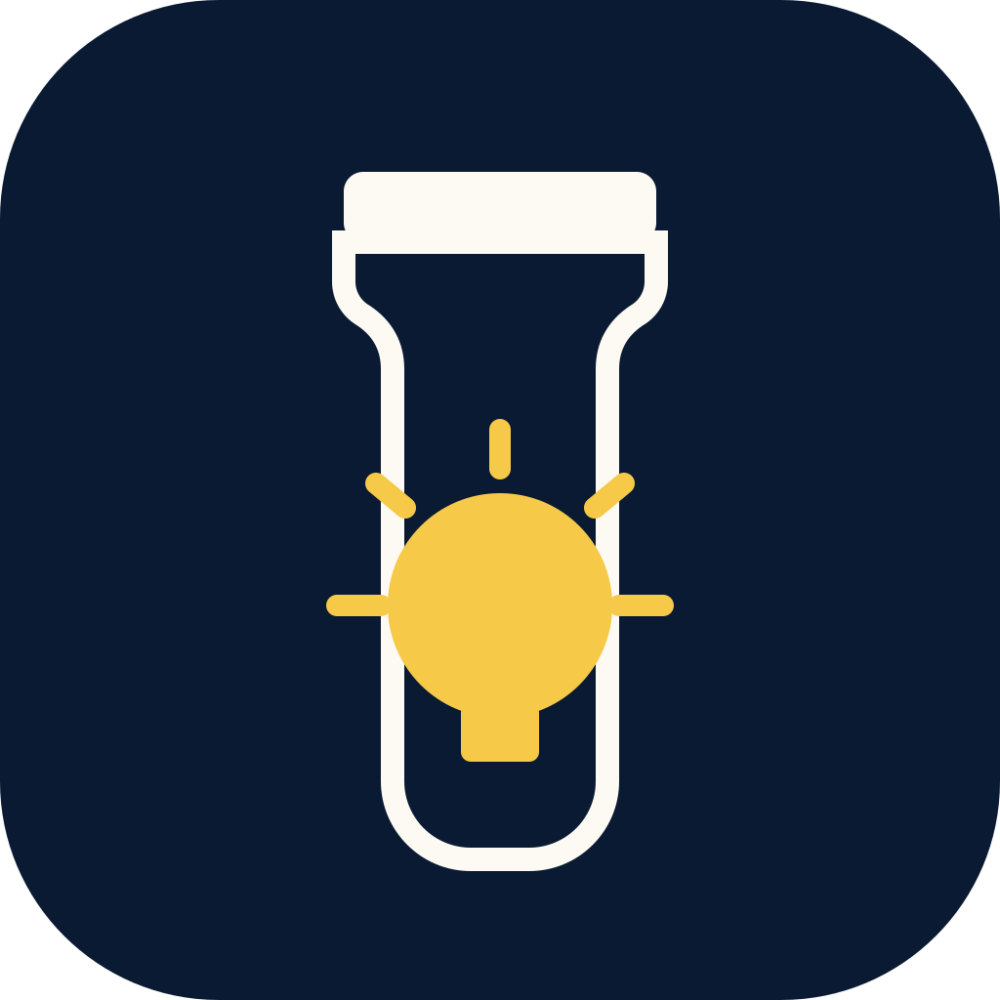
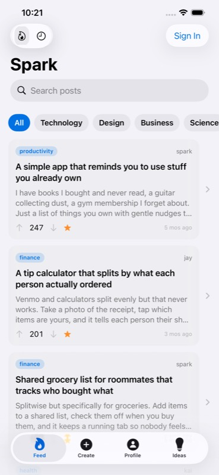
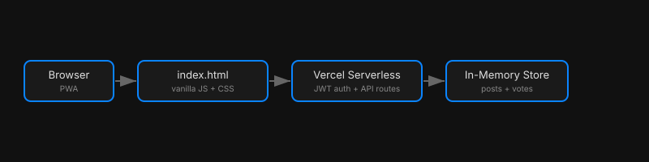

# Sparkjar

  [](https://github.com/nulljosh/sparkjar)

A jar of ideas. Post one, vote on others, and every morning a new one shows up on its own.

Each idea gets turned into a build spec and a step-by-step plan, server-side. Upvotes, comments, sign-in. Native apps for iOS, macOS and watchOS.

[Live](https://sparkjar.heyitsmejosh.com)


## Platforms

| Platform | Version | Status |
|---|---|---|
| Web (PWA) | v2.2.0 | Live |
| iOS | 1.0 | Submitted: waiting for review |
| macOS | 1.0.1 | [Live on the Mac App Store](https://apps.apple.com/app/id6785162492) |
| watchOS | v1.0.0 | Bundled with iOS |




## Features

- Plain JS. One `index.html`, no build step
- Sign up, log in, Face ID or Touch ID on iOS
- Filter by category. Sort by Hot or New
- One column, one idea at a time, infinite scroll
- Upvotes that feel instant
- A new idea every morning, written on Cloudflare Workers AI
- Every idea grows a build spec and a plan
- Idea Bases: clusters of ideas around a topic
- Comment threads. Markdown export
- Dark and light
- Installs as a PWA and works offline
- Cloudflare Pages Functions and Supabase Postgres with RLS on
- Two columns on desktop, one on mobile
- Tags: tech, design, business, random
- Seeded with good ideas so new users don't land on nothing

## Run

```bash
npx serve .
npm test
```

Deploy the site: `npm run deploy` (Cloudflare Pages).

The feed feeds itself. `POST /api/ai?type=generate` writes one idea. `POST /api/ai?type=enrich`
fills in its spec and plan. Both run on Workers AI through the `AI` binding. No API key anywhere.

Pages can't hold a cron, so the 09:00 schedule lives in a tiny sidecar Worker whose only
job is to call those two endpoints:

```bash
npx wrangler deploy --config worker/wrangler.jsonc
```

To enrich posts that predate the schedule:
`SPARK_DAEMON_SECRET=... bash scripts/backfill-enrich.sh`

## Database Setup (one-time)

Run this in the [Supabase SQL editor](https://supabase.com/dashboard/project/tjsxsqlxjmanwvmywwvw/sql/new) to enable pixel avatar support:

```sql
alter table users add column if not exists avatar_url text;
```

## Known Issues


## Security Roadmap

- [ ] Purge old `.env` from git history (was committed in 3 old commits, no longer tracked): `brew install git-filter-repo && git filter-repo --path spark/.env --invert-paths` then force-push

## App Store Submission

The ASC record exists (id 6785162492). The IPA is built and exported. Upload is blocked on the Xcode 26 beta SDK, which the App Store rejects. When Xcode 26 goes stable:

```bash
asc builds upload --app 6785162492 --ipa /tmp/SparkExport/Spark.ipa --wait
```

Screenshots ready in `screenshots/ios/` (feed, sign-in, profile, ideas). Metadata in `ios/fastlane/metadata/en-US/`.

## Roadmap

**App Store, icons (2026-06-28)**
- [x] App icon alpha channel stripped (was why ASC showed blank icon, Apple drops icons with alpha); macOS icon set created + wired in project.yml. Use `~/.agents/skills/icon/`.
- [ ] **Ship fresh iOS + macOS builds**, icons are fixed on disk but ASC only updates the icon from a newly *processed* build. `xcodegen generate` in ios/ and macos/, then archive + upload (`ship` / asc-xcode-build), wait ~5–30 min.
- [ ] Pick a mononame (rename "Spark Ideas"), cascades into bundle IDs + ASC records, do as its own task

**App Store**
- [ ] Submit iOS to App Store, blocked on Xcode 26 stable (beta SDK rejected by ASC); IPA + ASC record ready
- [ ] Submit macOS to Mac App Store, widget embed error fixed 2026-07-01 (SparkWidgets appex was missing CFBundleIdentifier; GENERATE_INFOPLIST_FILE now on), build succeeds locally. ASC record created 2026-07-01 (Spark Mac, id 6786482755). Remaining: archive + upload (`asc-xcode-build`)
- [ ] Add marketing landing page at `/landing` (currently feed is the homepage)
- [ ] 1 more iOS screenshot (post detail with AI enrichment) for 5-screenshot requirement

**Auth & Accounts**
- [ ] SMTP email delivery for password reset
- [ ] watchOS login UI (currently view-only without iOS pre-auth)

**Features**
- [ ] Real-time updates via Supabase Realtime
- [ ] Infinite scroll / pagination (feed currently loads all posts)
- [ ] Moderation tools

**Done**
- [x] iOS + macOS + watchOS companion apps
- [x] AI enrichment (SPEC + PLAN, server-side on Workers AI)
- [x] Idea Bases (AI topic clustering)
- [x] Comment threads
- [x] Seed 20+ quality ideas across all categories
- [x] ASC app record, PrivacyInfo.xcprivacy, fastlane metadata, screenshots

## Changelog

- v2.0.0: JWT_SECRET rotated, Supabase RLS hardened
- v1.3.0: Better seed ideas, RLS enabled on all Supabase tables, comment threads, iOS v2.0 (comments, profiles, sort, badges, 60+ tests), macOS + watchOS companions, WidgetKit widgets
- v1.2.0

## License

MIT 2026 Joshua Trommel

## From Spark.pdf (imported 2026-06-28)
- [x] Renamed ASC app from "Spark - spark" → "Spark: Ideas" (2026-06-28)

## Whitepaper

[Technical whitepaper](WHITEPAPER.md)

## API and agent tools

An agent can drive this app. [`docs/API.md`](docs/API.md) lists the HTTP surface, where there
is one, and the WebMCP tools registered on `document.modelContext`. Tools come in three kinds:
read-only, writes you can undo, and the few that ask a human first.

## Architecture


